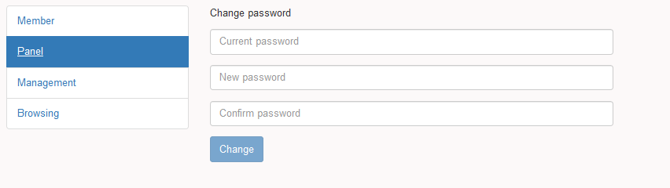
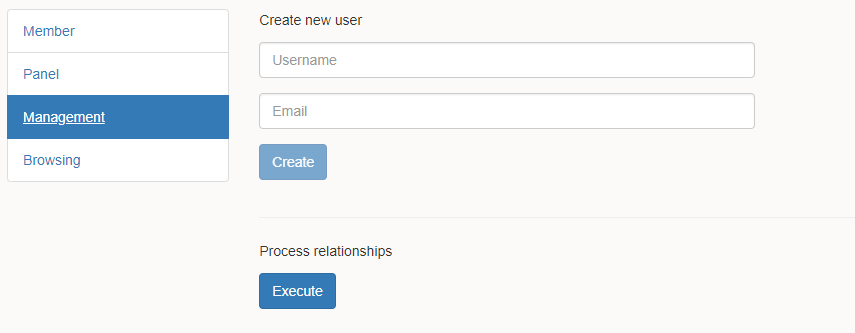

[](https://github.com/gcastellov/news-track/actions/workflows/dotnet.yml)
[](https://github.com/gcastellov/news-track/actions/workflows/main.yml)
[](https://codecov.io/gh/gcastellov/news-track)

# News Track
News Track is a news tracking or news aggregator website where users can share the content they find on Internet and give to it certain visibility.


The project is made by using .NET 5 as backend and ElasticSearch as NoSQL database while its frontend is made with Angular 12 and Bootstrap 3.

## Features
- Membership control panel
- Content browser
- Search engine
- Last news
- Most popular news
- Most embarrasing news
- Related news
- Suggested news and tags
- Corporate content (terms, privacy and about us)

#### Content browser
By using this feature the user is able to browse a given URL and choose an image, a title and some paragraphs that represent the news. At same time the user can relate this content to other content that is already on the system and tag it with the most representative words.
It's important to tag and relate to other existing content properly because the suggestion process algorithm uses this information in order to accomplish more accurate suggestions.


#### Search engine
The user is able to search content by using relevant words and tags.


#### Last news
This feature lists the last incoming news on the system.


#### Most popular news
This feature lists the most viewed news on the system. Once a user get a certain news, the viewes counter gets increased.

#### Most embarrasing news
This feature lists the most embarrassing news on the system. The user is able to complain about certain content. Once a user clicks the embarrasing button, the counter gets increased.

#### Related news
This feature lists related content.

#### Suggested news and tags
As much content the system has, the better. The algorithm will search for related news and tags to match other content and get suggestions.

#### Membership control panel
Nowadays the membership is limited to admin purposes, meaning that only the admin and contributors can post news, create new users, change current password, and dispatch the suggestion process. In a near feature more kind of users will be added.




To set your admin settings, update your backend appsettings.json file. Once the application wakes up it will create the user.

```json
  "Admin": {
    "Username": "ADMIN_USERNAME",
    "Email": "ADMIN_EMAIL_ADDRESS",
    "Password": "ADMIN_PASSWORD"
  }
```

#### Corporate content
Built-in section with Terms, Privacy and About us. You only need to update the assets/appsettings.json file to customize your website.

```json
{
    "defaultLanguage": "en",
    "brand": "NewsTrack",
    "twitterUrl": "http://www.twitter.com",
    "facebookUrl": "http://www.facebook.com",
    "githubUrl": "http://www.github.com",
    "corporation": "NewsTrack Corp",
    "country": "Spain"
}
```

Remove the social media URLs or leave them blank in case you don't want to make them appear at the website's footer.


## Configuration
Update the backend appsettings.json file for the following purposes:

```json
"ConnectionStrings": {
    "ElasticSearch": "http://localhost:9200"
  }
```
Set your ElastichSearch endpoint.

```json
"Websites": [
    "www.somewebsite.com"
  ]
```
Set your website black list in order to warn you that the content you are about to post belongs to certain owner.

```json
"Smtp": {
    "From": "SENDER",
    "Username": "SMTP_USERNAME",
    "Host": "SMTP_HOSTNAME",
    "Password": "SMTP_PASSWORD",
    "Port": "SMPT_PORT_NUMBER"
  }
```
Set your SMTP settings in order to get email warnings in case your account has been blocked, account created or account confirmed. Leaving the settings as empty the engine will generate email files into a directory called **outbox**.

```json
  "Tokens": {
    "Issuer": "http://localhost/NewsTrack.WebApi",
    "Audience": "http://localhost:4200",
    "Key": "SIGNING_KEY"
  }
```
Set your JWT settings.

```json
"ApiUrl": "http://localhost/NewsTrack.WebApi"
```
Set your public website domain (with or without path).

```json
"SignInUrl": "http://localhost:4200/authentication"
```
Set your frontend authentication URL where the user has to be redirected once he confirms his membership.

## Docker

There are a couple of compose files. The one located under */docker/backing-services* creates only the ELK replicaset, while the one in */docker* creates the images and containers for the frontend and backend along with the ES cluster by using the set up *Docker* environment.

```
docker-compose up
```
